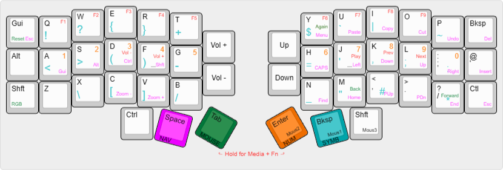

# Corne (crkbd) keyboard layout

keymap layout for 46-key CRKBD (v4.1)

For those unfamiliar, the Corne (aka CRKBD) is a split 'ergonomic' keyboard, with 3x6 staggered ortholinear columns and 3 thumb keys.

## Considerations

Following [Mark Stosberg](https://mark.stosberg.com/markstos-corne-3x5-1-keyboard-layout/), I have a few initial considerations for a keymap that works _for me_:

- Maintain broad similarity to 'regular' keyboards. I'm not always using my corne, and moving between keyboards can be frustrating. That means keeping it QWERTY.
- Simple layers where possible.
- Programming. I'll be using a lot of symbol keys, so they need to be arranged logically and easily accessed.
- Blank keycaps (aesthetics seemed to take precedent during build, and I'm too stubborn to back down now). Keys need to be arranged in a way that makes sense to learn, and easy to remember.
- Learning to type on a split keyboard is a nightmare. I'm practicing with [keybr.com](https://www.keybr.com/)

## My keyboard

I'm using crkbd v4.1 pcb, the 46-key version, with hotswappable (MX) Outemu v3 Silent Peach (linear) and Silent Lemon (slightly tacticle) switches.
I'm using the [VIAL](https://get.vial.today/) firmware.

## Useful resources

I've found these helpful in experimenting with different layouts:

- [Corne GitHub](https://github.com/foostan/crkbd)
- [Mark Stosberg](https://mark.stosberg.com/markstos-corne-3x5-1-keyboard-layout/) - excellent article about the development of a personal layout
- [Miryoku](https://github.com/manna-harbour/miryoku) - 'an ergonomic, minimal, orthogonal, and universal keyboard layout.'
- [KeymapDB](https://keymapdb.com/?keyboard=Corne) - repository of user keymaps
- ['Designing a Symbol Layer'](https://getreuer.info/posts/keyboards/symbol-layer/index.html) - Pascal Getreuer article, 2021/23

### Disclaimer

This is my personal keyboard layout and subject to change at any time.
